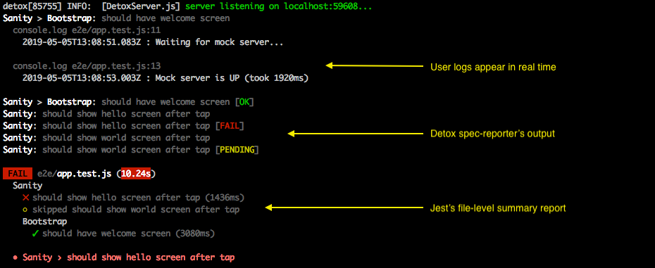

## Disclaimer

This guide describes installing Detox with Jest on a fresh project.

It has been officially tested only with `jest@24.x`, and you cannot
apply it to the older versions of Jest.


If you're migrating an existing project, please apply some common sense in the process.


## Installation

### 0. Set up Detox

If you haven't already, use the [Getting Started](Introduction.GettingStarted.md) guide to set up Detox from scratch.

### 1. Install Jest as an npm dependency

```sh
> npm install --save-dev jest
```

### 2. Run Detox init

```sh
> detox init -r jest
```

**IMPORTANT:** Before proceeding to the next step, please verify that `detox init` command
succeeded and the logs are green. Otherwise, be sure to address the issues specified with red color.
**For the official reference, you can also use the
[`demo-react-native-jest`](https://github.com/wix/Detox/tree/master/examples/demo-react-native-jest)**
example project.

### 3. Fix & Verify

Go over these fundamental things:


| File              | Property                     | Value                                       | Description                                                                                                                                                                                                                                                                                                         |
|-------------------|------------------------------|---------------------------------------------|---------------------------------------------------------------------------------------------------------------------------------------------------------------------------------------------------------------------------------------------------------------------------------------------------------------------|
| `package.json`    | `["detox"]["test-runner"]`   | `"jest"`                                    | Required. Should be `"jest"` for the proper `detox test` CLI functioning.                                                                                                                                                                                                                                           |
| `package.json`    | `["detox"]["runner-config"] `| (optional path to jest config file)         | Optional. This field tells `detox test` CLI where to look for Jest's config file. If omitted, the path defaults to "e2e/config.json" (a file generated by `detox init -r jest`).                                                                                                                                    |
| `e2e/config.json` | `["testEnvironment"] `       | `"node"`                                    | Mandar Required for the proper functioning of Jest and Detox.                                                                                                                                                                                                                                                       |
| `e2e/config.json` | `["setupFilesAfterEnv"] `    | `["./init.js"]`                             | Paths to files to run before each test suite. The field was [introduced in Jest 24](https://jestjs.io/docs/en/configuration#setupfilesafterenv-array).                                                                                                                                                              |
| `e2e/config.json` | `["reporters"]`              | `["detox/runners/jest/streamlineReporter"]` | Optional field. Available since `detox@12.7.0`. A highly recommended [Jest reporter](https://jestjs.io/docs/en/configuration#reporters-array-modulename-modulename-options), tailored for running end-to-end tests in Jest, which in itself was mostly intended for running unit tests. For more details, [see the migration guide](Guide.Migration.md#migrating-to-1270-from-older-nonbreaking). |
| `e2e/config.json` | `["verbose"]`                | `true`                                      | Must be `true` if you have replaced Jest's `default` reporter with Detox's `streamlineReporter`. Optional otherwise.                                                                                                                                                                                                |

For the reference, you can look into:

* [examples/demo-react-native-jest/package.json](https://github.com/wix/Detox/blob/master/examples/demo-react-native-jest/package.json#L25)
    
* [examples/demo-react-native-jest/e2e/config.json](https://github.com/wix/Detox/blob/master/examples/demo-react-native-jest/e2e/config.json)

The last two fields are recommended but not mandatory, if you are okay with Jest's default logging.
However, if you adhere to the recommendation, then streamlined test results will be showing up in real time,
making it easy to put all the pieces together, especially during e2e tests development:



> **Disclaimer:** the `streamlineReporter` was officially tested only with Jest 24.7.1.
Please file a bug report if experience integration issues with more recent Jest versions.


##### The custom initialization code for Jest (aka `e2e/init.js`)

See [examples/demo-react-native-jest/e2e/init.js](https://github.com/wix/Detox/blob/master/examples/demo-react-native-jest/e2e/init.js) for the reference.
The highlights are:

- `beforeAll()`, `beforeEach()`, `afterAll()` should be registered as hooks
for invoking `detox` and/or a custom adapter.
- Required. The custom Detox-Jest adapter must be registered as a `jasmine`
reporter (`jasmine.getEnv().addReporter()`). It is required for the
[artifacts subsystem](APIRef.Artifacts.md) to properly work.
- Recommended. Since `detox@12.7.0`, an additional, custom `spec-reporter`
should be registered as a `jasmine` reporter, as well.
This one takes care of logging on a per-spec basis
(i.e. when an `it` starts and ends) — which Jest does not do by default.
Should be used in conjunction with the Detox-Jest adapter.

## Writing Tests

There are some things you should notice:

- Don't worry about mocks being used, Detox works on the compiled version of your app.
- Detox exposes it's primitives (`expect`, `device`, ...) globally, it will override Jest's global `expect` object.


## Parallelism

Through Detox' cli, Jest can be started with [multiple workers](Guide.ParallelTestExecution.md) that run tests in simultaneously. In this mode, Jest effectively assigns one worker per each test file (invoking jasmine over it). In this mode, the per-spec logging offered by the `spec-adapter` mentioned earlier, does not necessarily make sense, as the workers' outputs get mixed up.

Unfortunately, there's no way of telling whether parallelism has been enabled, at the adapter's scope (different JS contexts). If you find this way of logging unsuitable in a multiple-workers environment (typically an automated CI build), consider limiting the `spec-adapter`'s registration in your test-init file (e.g. by using a dedicated environment variable).


## How to run unit test and E2E tests in the same project

- If you have a setup file for the unit tests pass `./jest/setup` implementation into your unit setup.
- Call your E2E tests using `detox-cli`: `detox test`
